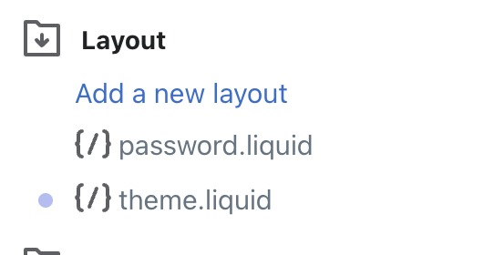

![Built With Stencil](https://img.shields.io/badge/-Built%20With%20Stencil-16161d.svg?logo=data%3Aimage%2Fsvg%2Bxml%3Bbase64%2CPD94bWwgdmVyc2lvbj0iMS4wIiBlbmNvZGluZz0idXRmLTgiPz4KPCEtLSBHZW5lcmF0b3I6IEFkb2JlIElsbHVzdHJhdG9yIDE5LjIuMSwgU1ZHIEV4cG9ydCBQbHVnLUluIC4gU1ZHIFZlcnNpb246IDYuMDAgQnVpbGQgMCkgIC0tPgo8c3ZnIHZlcnNpb249IjEuMSIgaWQ9IkxheWVyXzEiIHhtbG5zPSJodHRwOi8vd3d3LnczLm9yZy8yMDAwL3N2ZyIgeG1sbnM6eGxpbms9Imh0dHA6Ly93d3cudzMub3JnLzE5OTkveGxpbmsiIHg9IjBweCIgeT0iMHB4IgoJIHZpZXdCb3g9IjAgMCA1MTIgNTEyIiBzdHlsZT0iZW5hYmxlLWJhY2tncm91bmQ6bmV3IDAgMCA1MTIgNTEyOyIgeG1sOnNwYWNlPSJwcmVzZXJ2ZSI%2BCjxzdHlsZSB0eXBlPSJ0ZXh0L2NzcyI%2BCgkuc3Qwe2ZpbGw6I0ZGRkZGRjt9Cjwvc3R5bGU%2BCjxwYXRoIGNsYXNzPSJzdDAiIGQ9Ik00MjQuNywzNzMuOWMwLDM3LjYtNTUuMSw2OC42LTkyLjcsNjguNkgxODAuNGMtMzcuOSwwLTkyLjctMzAuNy05Mi43LTY4LjZ2LTMuNmgzMzYuOVYzNzMuOXoiLz4KPHBhdGggY2xhc3M9InN0MCIgZD0iTTQyNC43LDI5Mi4xSDE4MC40Yy0zNy42LDAtOTIuNy0zMS05Mi43LTY4LjZ2LTMuNkgzMzJjMzcuNiwwLDkyLjcsMzEsOTIuNyw2OC42VjI5Mi4xeiIvPgo8cGF0aCBjbGFzcz0ic3QwIiBkPSJNNDI0LjcsMTQxLjdIODcuN3YtMy42YzAtMzcuNiw1NC44LTY4LjYsOTIuNy02OC42SDMzMmMzNy45LDAsOTIuNywzMC43LDkyLjcsNjguNlYxNDEuN3oiLz4KPC9zdmc%2BCg%3D%3D&colorA=16161d&style=flat-square)

# Leadclick - Widget

A widget built for fast communication in your landing page, allow your customers to contact you easily and in just in a few clicks.

---

## Wordpress - Usage

From your admin dashboard go to Pages and search the page you want the widget to appear. Once you've found it, click on it.


Scroll down and click on "Edit with elementor".


From that new page, search for HTML on the left sidebar. Drag the icon that says HTML and has a </> icon. Drop it into the center of the page.


The sidebar will change and display a textbox. Paste the code generated in leadsales here and click on update.


And done, you have your widget up and running.

**Note:** If you want to hide the widget for any reason, set the orientation property to `none`

## Shopify - Usage

From your admin dashboard go to Themes.


Then go to your current theme and click on Actions, then on Edit code


On the Layout folder click on the file named **theme.liquid**


Scroll down to the end of the file and after the closing </ body > tag paste the generted code from Leadsales.


Finally click on the green save button at the top of the page. And done, you have your widget up and running.

**Note:** If you want to hide the widget for any reason, set the orientation property to `none`

## React - Usage

Install the project with npm

```bash
  npm install @leadsales/leadclick --save
```

Hydrate components inside your `index.js` file

```js
import { applyPolyfills, defineCustomElements } from '@leadsales/leadclick/dist/loader';

applyPolyfills().then(() => {
  defineCustomElements(window);
});
```

Import our component into our App.js file and use the html tag in your code.

```js
import '@leadsales/leadclick';

function App() {
  return (
      //Use snippet generated on leadsales here
  )
}
```

## Angular - Usage

Paste the script tag inside your `index.html`

```html
<script type="module" src="https://cdn.jsdelivr.net/npm/@leadsales/leadclick@1.4.0/dist/leadclick/leadclick.esm.js"></script>
<meta charset="utf-8" />
```

Use the **leadsales generated snippet** in your app.component.html file.

## Vue - Usage

Install the project with npm

```bash
  npm install @leadsales/leadclick --save
```

Hydrate de component in your `main.js` file

```js
import { defineCustomElements as defineLeadclick } from '@leadsales/leadclick/dist/loader';

defineLeadclick(window);

Vue.config.ignoredElements = ['leadclick-widget'];
```

## And that's it, you can use the leadsales generated snippet in any template you want

## Component documentation

Check the this link to see the props and structure of the widget

[leadclick-widget](https://github.com/Leadsales/leadclick/tree/main/src/components/leadclick#readme)

---

## Demo

Check our demo at [leadsales.io](https://leadsales.io/)

---

## Contributors

- [@karlaromerox3](https://github.com/karlaromerox3)

---

## License

[MIT](https://choosealicense.com/licenses/mit/)
